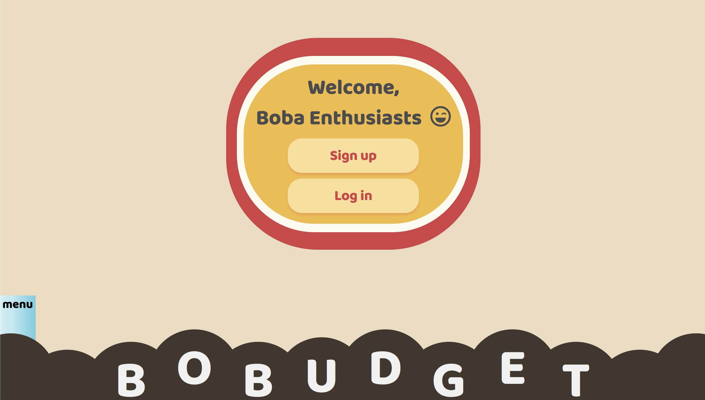
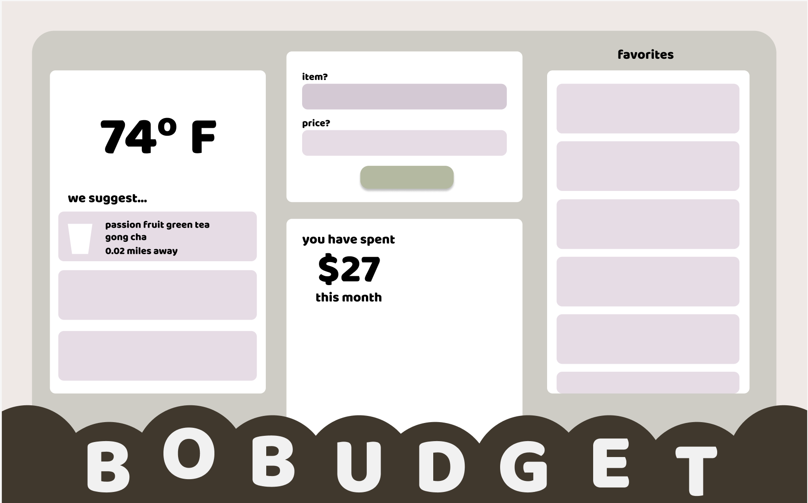

# BoBudget
_A budgeting app for boba lovers._



[BoBudget Live](https://bobudget.herokuapp.com/)

## Background and Overview

Ever just find yourself saying: "Just one more boba this month won't hurt!" 
Or have you asked yourself: "How many times have I already gotten boba this month...?"
Or maybe you've spent 15 minutes with your friend at the boba shop staring at the menu
because you guys can't decide what to get.

Enter **BoBudget**, a minimal viable product that gives you a simple way to track and budget your bubble tea expenses, or make an easy decision on what drink to get if you are feeling adventurous!

## Functionality and MVP
1. User Authorization: Account Signup, Login, and Logout
2. Purchase history renders all purchases for the month and allows for budget updates and purchase updates
3. Dashboard of widgets includes:
    - Favorites list: favorites can be viewed and deleted
    - Budget calculator: purchases can be added and budgeting will be calculated
    - Boba randomizer: click a boba to generate a drink
4. Search functionality returns stores where drinks can be found and directions via Google Maps. 
5. Drinks can also be favorited or deleted on search page, and will be added/deleted on your favorites list
6. Production README

## WireFrames
Dashboard Sample Layout:


Search Sample Layout:


## Technologies and Technical Challenges
- Front-end: React, Node.js
- Back-end: MongoDB, Express
- Cloud: Heroku, AWS

Handling favorites on the search page:
```javascript
handleClick(id, add) {
    if (add) {
      this.setState({ bobaId: id },
        () => this.handleAddFavorite()
      );
    } else {
      this.setState({ bobaId: id },
        () => this.handleRemoveFavorite()
      );
    }
  }

  handleAddFavorite() {
    let favorite = {
      userId: this.props.currentUser.id,
      bobaItemId: this.state.bobaId
    }

    this.props.createFavorite(favorite).then(() => 
      this.props.fetchFavorites(this.props.currentUser.id)
    );
  }

  handleRemoveFavorite() {
    this.props.removeFavorite(this.state.bobaId).then(() => 
      this.props.fetchFavorites(this.props.currentUser.id)
    );
  }
```

Rendering favorites on the dashboard:
```javascript
render() {
    const { favorites, bobas } = this.props;

    if (!favorites || !bobas.data) return null;

    const favoritesList = favorites.map((fav) => {
      if (bobas.data) {
        for (let i = 0; i < bobas.data.length; i++) {
          let boba = bobas.data[i];

          if (fav.bobaItemId === boba._id) {
            return (
              <li className="fav" key={`fav-${boba._id}-${fav._id}`}>
                {boba.name}
                <button onClick={() => this.openModal(boba.name, fav._id)}>
                  <i className="fas fa-heart" />
                </button>
              </li>
            );
          } 
        }
      }

      return null;
    });
}
```
To render a list of favorites, we wanted to make sure we were able to grab the 
current user's favorited items, matching the Favorite's ```bobaItemId``` to the 
BobaItem's ```id``` and then returning the correct boba ```name```. We also 
added the option to delete on the favorites list.

## Group Members
- David Hong [Flex Developer / Back-End]
- Jun (Scott) Lee [Back-End Developer]
- Kara Liu [Front-End Developer]
- Nancy Ma [Team Lead]

## Future Implementations
- Weather widget that allows suggestions based on weather